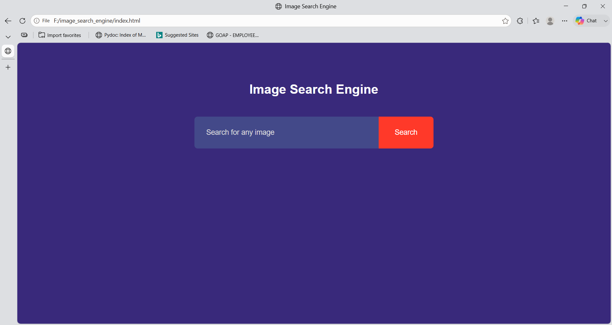
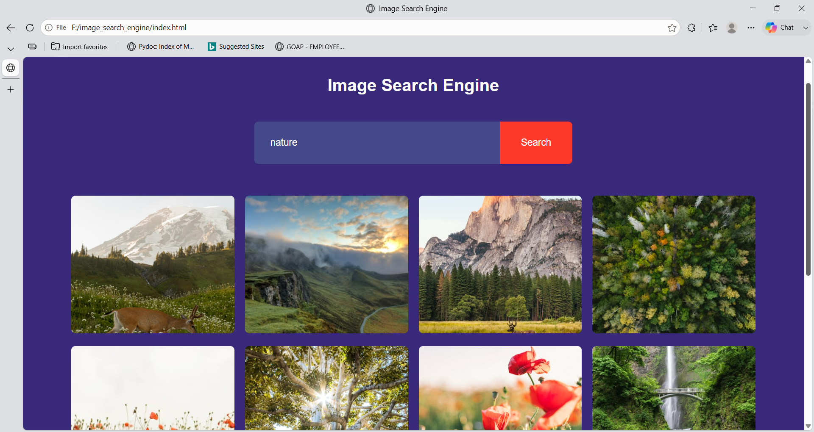

# 🖼️ Image Search Engine

A responsive Image Search Engine built using **HTML, CSS, and JavaScript** that allows users to search for high-quality images using the **Unsplash API**.

## 📌 Overview

This project enables users to search for images by entering a keyword. It fetches relevant images from the Unsplash API and displays them in a responsive gallery. Users can also load more images using the **Show More** button.

This project was built to practice working with:
- REST APIs
- JavaScript Fetch API
- Asynchronous Programming (async/await)
- DOM Manipulation
- Responsive Web Design

---

## 🚀 Features

- 🔍 Search images by keyword
- 🖼️ Responsive image gallery
- ➕ Load additional images using the "Show More" button
- 🔗 Open images in a new browser tab
- 📱 Responsive layout for different screen sizes

---

## 🛠️ Technologies Used

- HTML5
- CSS3
- JavaScript (ES6)
- Unsplash API

---

## 📂 Project Structure

```
Image-Search-Engine/
│
├── project_images/
│   ├── home.png
│   └── search-results.png
│
├── index.html
├── style.css
├── script.js
└── README.md
```

---

## ⚙️ How to Run the Project

### 1. Clone the repository

```bash
git clone https://github.com/ParnikaJakkam/Image-Search-Engine.git
```

### 2. Open the project folder

```bash
cd Image-Search-Engine
```

### 3. Get an Unsplash Access Key

1. Create a free developer account at https://unsplash.com/developers
2. Create a new application.
3. Copy your **Access Key**.

### 4. Add your Access Key

Open **script.js** and replace:

```javascript
const accessKey = "YOUR_ACCESS_KEY";
```

with

```javascript
const accessKey = "YOUR_UNSPLASH_ACCESS_KEY";
```

### 5. Run the project

Simply open **index.html** in your browser.

---

## 📸 Screenshots

### Home Page



### Search Results



---

## 🎯 Future Improvements

- ⏳ Loading spinner
- 🌙 Dark/Light mode
- ❤️ Favourite images
- 📥 Download button
- 🖼️ Fullscreen image preview
- 🔄 Infinite scrolling
- 🔍 Search suggestions
- 📜 Search history using Local Storage
- ⚠️ Better error handling

---

## 📚 What I Learned

During this project, I learned:

- Working with REST APIs
- Using Fetch API and async/await
- Parsing JSON responses
- Dynamic DOM manipulation
- CSS Grid layouts
- Responsive web design
- Handling user events in JavaScript

## 📄 License

This project is intended for educational and portfolio purposes.
